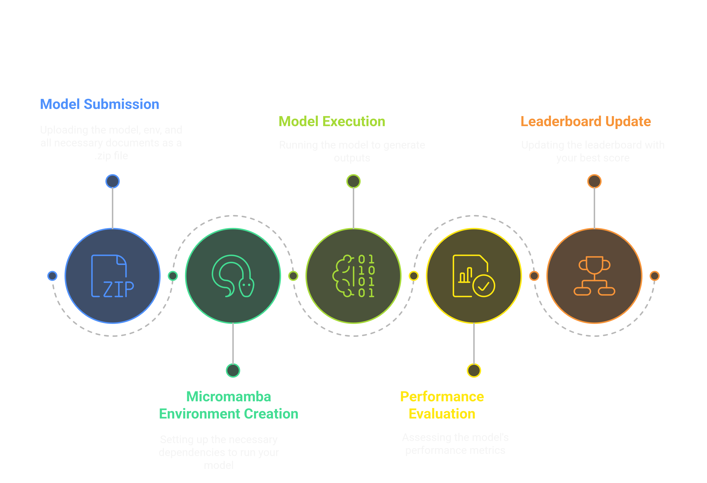
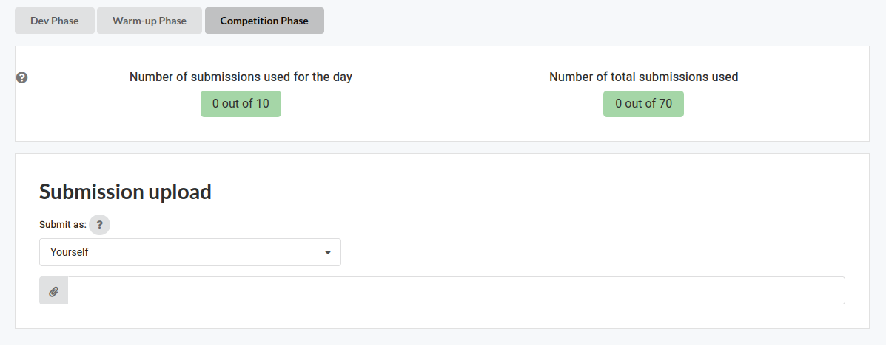
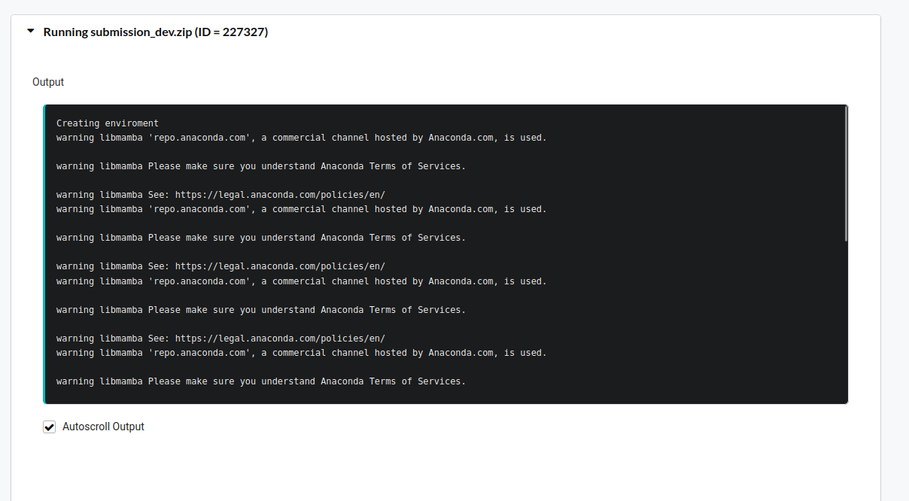
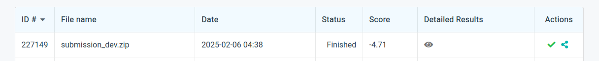
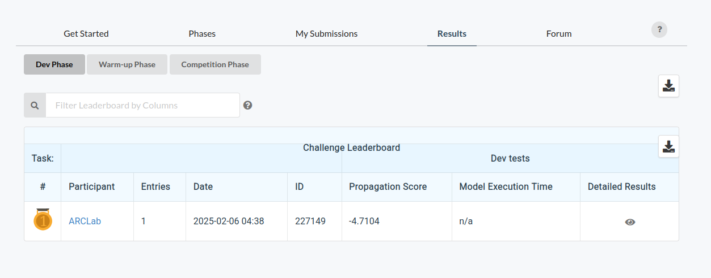
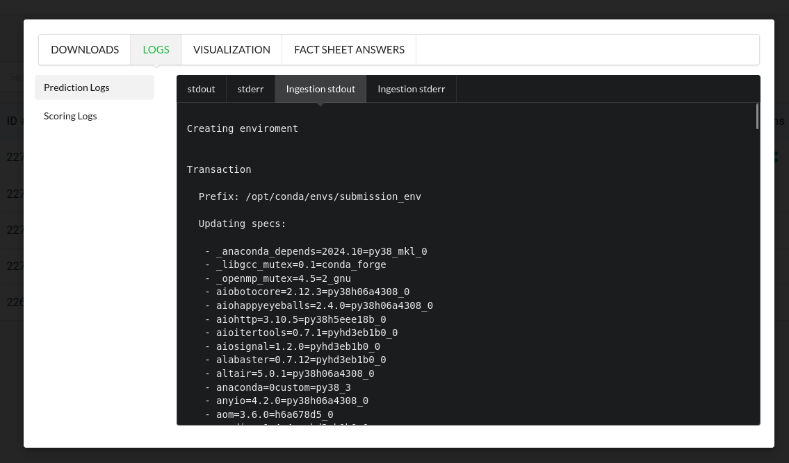

# Submission Tutorial

Participants will submit their trained algorithm, along with their code and workflow, to the competition platform in their preferred programming language. They should upload the model and all necessary documents in a compressed format. The performance of their trained AI algorithm will then be evaluated against our internal test data and evaluation metric on our server. Once the evaluation is complete, the results will be sent back to the live leaderboard.

## Details on the Submission Process

During the competition phase, participants will submit their trained models, along with the associated code or workflows, to the competition platform. The submission should be in the form of a `.zip` file, with all necessary files placed in the main directory.

It is mandatory for participants to include a `submission.py` Python script, which will serve as the entry point for execution. Participants should use this script to load the data, feed it into their model, and then save the output in the corresponding folder.

To ensure smooth execution and avoid dependency issues, all participants must also include an `environment.yml` file, exported from their Conda environment. To generate this file, run the following command:

```sh
(base)$ conda activate <env_name>
(<env_name>)$ conda env export > environment.yml
```
With all this in mind, your submission file should look something like the [baseline example](https://github.com/ARCLab-MIT/STORM-AI-devkit-2025/tree/main/baselines/Codabench):

```
submission.zip
├── submission.py                
├── environment.yml
├── model.pkl
├── orekit-data.zip
├── atm.py
└── propagator.py
```

Each submission will be evaluated on our remote server using internal test data and a predefined evaluation metric. Once the evaluation is complete, the results will be updated on the live [leaderboard](https://www.codabench.org/competitions/5547/#/results-tab) on the challenge platform.



This approach ensures the use of a private test dataset, protecting data privacy and preventing data leakage.


## Prepare code for the submission
### Input data for docker container

Your submission will be decompressed and loaded into a container inside the `/app/ingested_program` directory. From there, participants should focus on three relevant directories. The first is the `/app/data/dataset/test` directory, which contains all the input data, including the `initial_states.csv` file. The second important directory is `/app/output`, where participants should save their predictions in a file named `prediction.json`.

<div style="display: flex; flex-direction: column; background-color: #f9f9f9; border-left: 6px solid #4aa8ec; border-radius: 4px; padding: 15px; margin: 20px 0; box-shadow: 0 2px 4px rgba(0, 0, 0, 0.1); font-family: Arial, sans-serif;">
    <div style="font-size: 18px; font-weight: bold; color: #ffffff; background-color: #4aa8ec; display: inline-block; padding: 5px 10px; border-radius: 3px; margin-bottom: 10px;">ℹ️ Note</div>
    <p style="font-size: 14px; margin: 0; color: #555;">All the directories mentioned are <strong>absolute path directories</strong>. They are not relative to the current working directory. Please ensure you use absolute paths in your submission script.</p>
</div>

Then, the directory structure is as follows:
```
/app
 ├── data
 |    └── dataset                  
 |        └── test
 |            ├── goes                
 |            |    ├── 70000-goes.csv 
 |            |    ├── 70001-goes.csv            
 |            |    └── ...
 |            ├── omni2
 |            |    ├── 70000-omni2.csv 
 |            |    ├── 70001-omni2.csv            
 |            |    └── ... 
 |            └── initial_states.csv  # Where predictions should start
 ├── ingested_program
 |     ├── submission.py
 |     ├── environment.yml
 |     └── ... 
 └── output
       └── prediction.json # It should appear after running the script


```

### Required outputs

As previously mentioned, your submission must generate predictions and save them as a JSON file named `prediction.json`.

- The JSON file should be saved to `/app/output/submission.json` in the Docker container.
- The output `.json` file should look like this:

```json
{
    "10000": {
        "Timestamp": ["2014-01-28T00:00:00+00:00", "2014-01-28T00:10:00+00:00", ...],
        "Orbit Mean Density (kg/m^3)": [9.465688182090279e-20, 9.46567202621894e-20, ...]
    },
    "10001": {
        "Timestamp": ["2024-01-28T00:00:00+00:00", "2024-01-28T00:10:00+00:00", ...],
        "Orbit Mean Density (kg/m^3)": [9.42342342343432e-20, 9.12343453432e-20, ...]
    }
}
```

<div style="display: flex; flex-direction: column; background-color: #f9f9f9; border-left: 6px solid #4aa8ec; border-radius: 4px; padding: 15px; margin: 20px 0; box-shadow: 0 2px 4px rgba(0, 0, 0, 0.1); font-family: Arial, sans-serif;">
    <div style="font-size: 18px; font-weight: bold; color: #ffffff; background-color: #4aa8ec; display: inline-block; padding: 5px 10px; border-radius: 3px; margin-bottom: 10px;">ℹ️ Note</div>
    <p style="font-size: 14px; margin: 0; color: #555;">You can check the <a href="https://2025-ai-challenge.readthedocs.io/en/latest/baseline.html">baseline solution</a> to better understand how your submission should be.</p>
</div>

The competition will be hosted on the [Codabench platform](https://www.codabench.org/competitions/5547/), where you will need to register on the challenge's Codabench webpage to submit your solutions. While we know you're eager to prepare your models, [here](https://github.com/codalab/codabench/wiki/User_Participating-in-a-Competition) are some general details to help you get started.

### Test the submission locally

It is **strongly recommended** that you test run your submission in the same environment where it will be executed during the evaluation process. This will help you catch any potential bugs in your code. You can download the image from [Docker Hub](https://hub.docker.com/repository/docker/arclabmit/ai-challenges/tags/micromamba-submission/sha256-1a1a9f45f99624dafa65741107f6f7c41ea86ba7f9784de0116fa2872cecdb3e). Use the following command to do so:

```bash
docker pull arclabmit/ai-challenges:micromamba-submission
```

#### 1. Prepare dummy version of the test dataset
- Download [this folder](https://www.dropbox.com/scl/fo/ilxkfy9yla0z2ea97tfqv/AB9lngJ2yHvf9t5h2oQXaDc?rlkey=iju8q5b1kxol78kbt0b9tcfz3&st=j7f0mcc3&dl=0) containing  test data (the data used in this phase of the challenge).
- Move it somewhere. We will refer to this path as `LOCAL_DATA_DIR`.
- You should end up with a path that looks like `LOCAL_DATA_DIR/test/`, and directory structure like the one at the begining of this page.

#### 2. Run the container
Open a terminal located where all resources are and run:
```
docker run --rm\
    --name my-test-submission\
    -v LOCAL_DATA_DIR/test:/app/data/dataset/test
    -v LOCAL_SUBMISSION_DIR:/app/ingested_program
    -v LOCAL_PREDICTIONS_DIR:/app/output
    -it
    arclabmit/ai-challenges:micromamba-submission 
```

In this command, `LOCAL_DATA_DIR` points to the path where you have extracted the test data, and `LOCAL_PREDICTIONS_DIR` points to the location where you want to see the results once the Docker container finishes. This command will:
- Mount your local data directory to `dataset/test` in the container.
- Mount your local submission directory to `/app/ingested_program` in the container.
- Mount your local output directory to the place where you want the results to be displayed.

This command will open an interactive shell where you can simulate the pipeline that the platform will execute. To do so, first load the environment with the following command:


```bash
yes | micromamba env create --name sub_env --file /app/ingested_program/environment.yml
```

Once this process has finished without errors, run:
```bash
micromamba run --name sub_env python submission.py
```

<div style="display: flex; flex-direction: column; background-color: #f9f9f9; border-left: 6px solid #4aa8ec; border-radius: 4px; padding: 15px; margin: 20px 0; box-shadow: 0 2px 4px rgba(0, 0, 0, 0.1); font-family: Arial, sans-serif;">
    <div style="font-size: 18px; font-weight: bold; color: #ffffff; background-color: #4aa8ec; display: inline-block; padding: 5px 10px; border-radius: 3px; margin-bottom: 10px;">ℹ️ Notes</div>
    <p style="font-size: 14px; margin: 0; color: #555;">
    <b>Note</b>: You can replace the <code>storm-ai-submission</code> with whatever name and tag you used to build the container.
    <br><br>
    <b>Note 2</b>: To test GPU, you will need to install the <a href="https://docs.nvidia.com/datacenter/cloud-native/container-toolkit/install-guide.html"> nvidia-container-toolkit</a>: You will also need to use <code>--gpus all</code> in the call to <code>docker run</code>.
    </p>
</div>


#### 3. Check the outputs
If the above commands finished correctly with your submission code, there should be a `LOCAL_PREDICTION_DIR/prediction.json` file, which is the name you used in your submission script to store your results. Open that file and ensure it is structured correctly. Once you've done that, you're ready to submit your code to our servers! 🎉


## Upload the submission to Codabench

The platform will guide you through this process when you visit the **My submissions** section of the Challenge Codabench webpage. However, we have also prepared a quick tutorial for your convenience.  

First, you need to compress all your submission files together. **Do not compress a folder**, but select each of the items and then compress them. This will automatically generate a parent directory. Once this file is ready, go to the [My submissions section](https://www.codabench.org/competitions/5547/#/participate-tab), select the user submitting the file, and upload it.



You can monitor the progress of your submission on the same page. A toggle button will appear, allowing you to unravel and view the outputs your submission is producing.



All your submissions will be compiled in the table at the bottom of the page. There, you can check whether the submission has finished or if any errors occurred.



The best of your submissions will be automatically published on the leaderboard once fully loaded. You can view this leaderboard at the following link:



Also, by clicking the eye icon, you can see detailed results of your submission, where you can check the various outputs from the execution in the logs section.



## Performance Evaluation

Once your model is running, you can evaluate it with the available data. The `evaluation.py` script provides a standard way to assess the performance of the models submitted for the challenge. It uses metrics and evaluation techniques that align with the challenge's objectives.

**Example Usage**

The `run_evaluator` function is the main entry point of the script and accepts the following arguments:

- `participant`: Path to the participant's JSON file.
- `ground_truth`: Path to the ground truth JSON file.

You can also run the script directly from the command line. For example:
```bash
python evaluation.py --participant=participant.json --ground_truth=ground_truth.json
```

## Important information

Please take note of each of the compatibility requirements below as they are <b>not</b> subject to change or exception.

### Computational restrictions for submissions

#### Hardware

The submission you make must take the following computational resource limits into consideration and not exceed them.

- **Computational resources**: Each submission will have access to an RTX 3090 GPU for execution. The other resources (CPU, RAM, and Memory) are shared, so there is no specific allocation for them.
- **Run Time**: Your submission should run within approximately 1 hour or less. If submissions take too long to run, they will fail.

